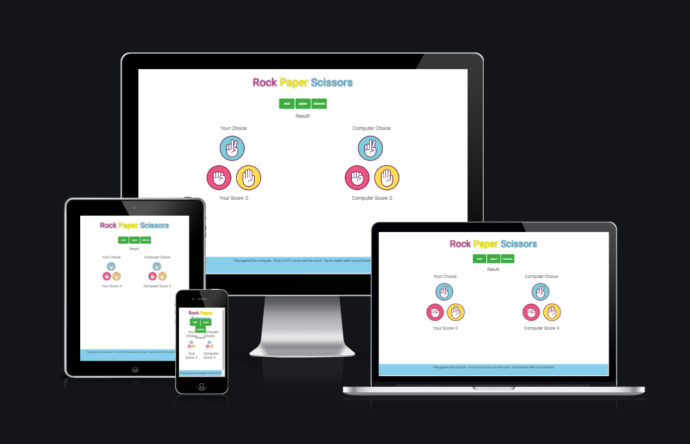
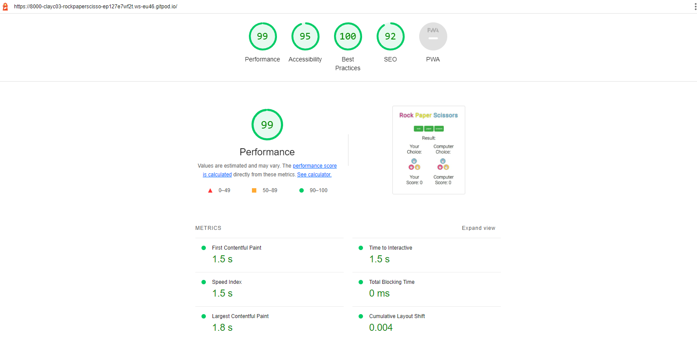
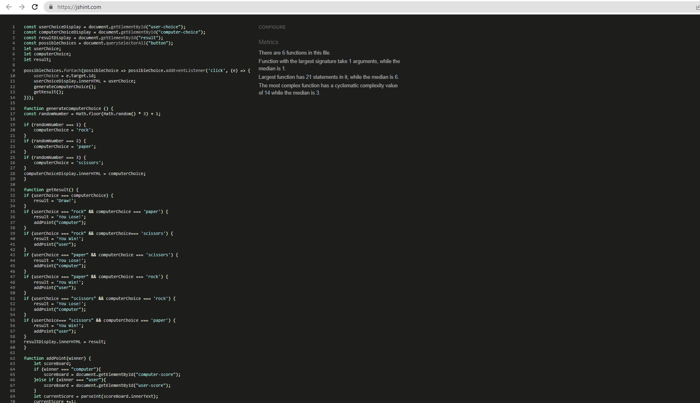
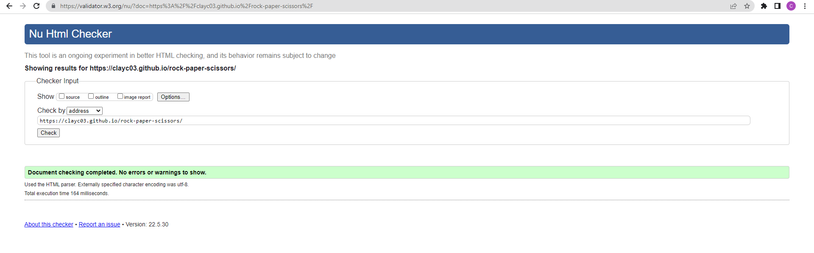
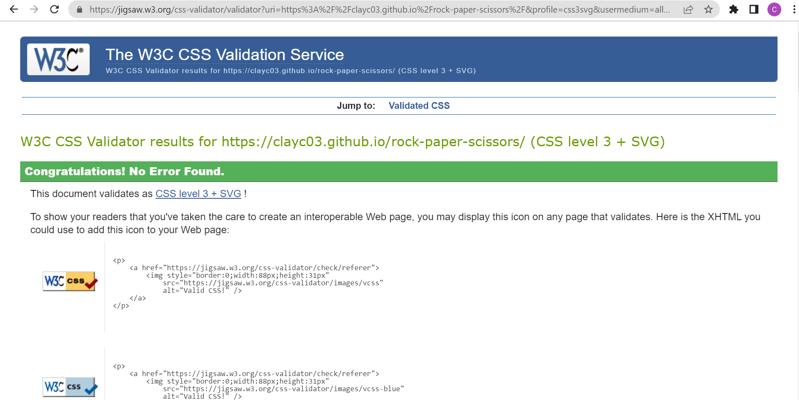
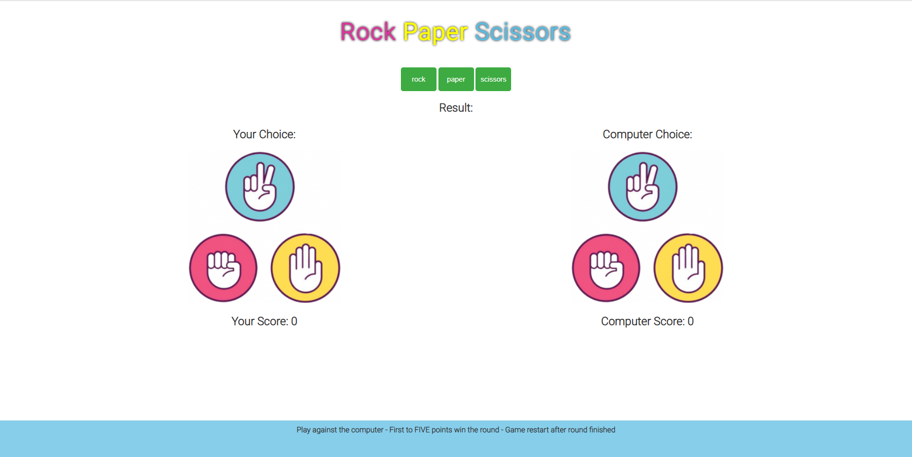
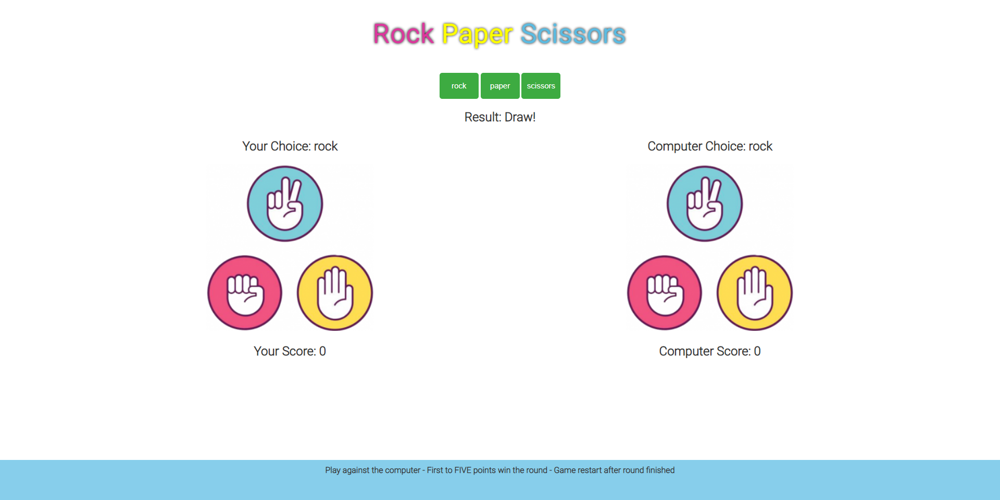
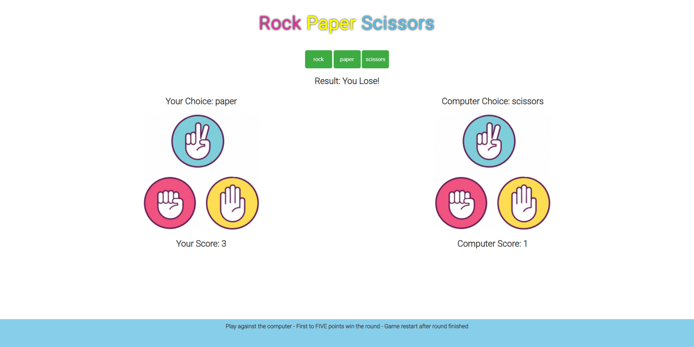
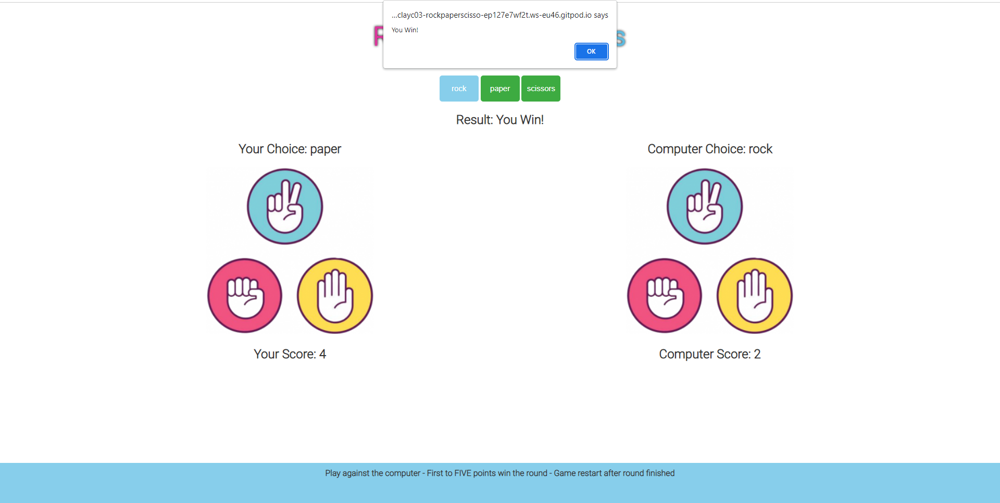

# ROCK PAPER SCISSORS
## Introduction

Rock Paper Scissors is a fun game tradionally played by two people using their hands to make the rock paper scissors signs. This game the user and computer will choose one of the three icons (rock, paper, scissors) available for selection. The "rock" beats "scissors", the "scissors" beat "paper" and the "paper" beats "rock"; if both players select the same shape, the game is a draw.

First one between the user and computer to get to FIVE points win the round. Game will restart and the next challenger can take on the computer. This is a great game for all age groups and easy to learn. So go on over and start playing, this game is so much fun!

## [View life website in github pages](https://clayc03.github.io/rock-paper-scissors/) 

<u>*Disclaimer - This website is for educational purpose only*</u>

## **[Table of Contents](#contents)**
1. **[Features](#features)**
2. **[Testing](#testing)**
3. **[Technology](#technology)**
4. **[Deployment](#deployment)**
5. **[Credits](#credits)**
6. **[Screenshots](#screenshots)**

1. ## Features
This website consists of a main page, with the full layout of the game on this page. 

Below are the website features:

## Header

* The logo at the top of the page and is centered with the colors of the rock, paper, scissors images used to color coordinate the logo with these images.

## Game selection

* The buttons to play the game is located just below the logo and the user can make use of these to select what option between rock, paper and scissors to use for each game.

## Gaming-Section

* This area shows what choice the user and computer has made and also show the result of who won the round and update the score as well.

## Footer

* The Footer gives a description of the game.

[Back to Table of contents](#table-of-contents)

2. ## Testing

## Functionality testing 

 I used Chrome developer tools throughout the project for testing for responsiveness of mobile and desktop. I also used [Firefox](https://www.mozilla.org/en-US/firefox/new/) and [Microsoft Edge](https://www.microsoft.com/en-us/edge) to test the funcionality of the website on desktop and mobile compatibility using these websites developer tools.
 
 [Chrome DevTools](https://developer.chrome.com/docs/devtools/) was helpfull throughout the development of this website.

## Compatibility testing

[Lighthouse](https://developers.google.com/web/tools/lighthouse) was helpfull throughout the development of this website for mobile and desktop compatibility.
 
This project was developed using a HP Pavilion laptop with Windows 11 Home and used also a Samsung 24 inch monitor. I also used my Huawei P30 Pro mobile to check the sites compatibility.

## Performance testing

I run [Lighthouse](https://developers.google.com/web/tools/lighthouse/) tool to check performance of the website.

Below are the final performance results received for compatibility in Lighthouse. 

## Validator testing

The deployed site address was run in JSHint for Javascript (JSHint JavaScript Validator), W3C Validator for HTML (https://validator.w3.org) and for CSS in (https://jigsaw.w3.org/css-validator/validator) and no errors or warnings were returned.

[Back to Table of contents](#table-of-contents)

3. ## Technology

For this website I used the following Technology:

**HTML5**
HTML5 is a markup language used for structuring and presenting content on the World Wide Web.

**CSS**
Cascading Style Sheets is a style sheet language used for describing the presentation of a document written in a markup language such as HTML.

**Javascript**
JavaScript, often abbreviated JS, is a programming language that is one of the core technologies of the World Wide Web, alongside HTML and CSS. Over 97% of websites use JavaScript on the client side for web page behavior, often incorporating third-party libraries.

**Google fonts**
Google Fonts is a computer font and web font service owned by Google.

**GitHub**
A provider of Internet hosting for software development and version control using Git. 

**Gitpod**
An open-source developer platform for remote development.

Back to Table of contents

4. ## Deployment

This milestone project was deployed to Github pages where a repository was created. All html and css code written / changes made was commited and pushed in Gitpod to save in Github.

* To deploy a project I had to:
  * In Github after creating the repository navigate to the settings tab.
  * Select the pages link on the left hand side. 
  * From the sources section click on the Branch button and select Main. 
  * After selection of the Main Branch the page will provide the link to the deployed site. 

5. ## Credits

## Content

I used the Code Institutes student template to complete this milestone project: [gitpod full template](https://github.com/Code-Institute-Org/gitpod-full-template)

* HTML & CSS Ideas:

    * Game buttons [w3schools.com](https://www.w3schools.com/css/css3_buttons.asp)
    * Game alert [w3schools.com](https://www.w3schools.com/jsref/met_win_alert.asp)

### Code

* I used some of the css code from the project scope from Code Institutes Ultimate Rock, Paper, Scissors to add styling to my gaming section. I also use the code from the footer and slight amend it.
* For ideas on javascript code for a rock paper scissors game I watched and used code from Kenny Yip Coding  - Learn how to make rock paper scissors in html css and javascript!
(https://www.youtube.com/watch?v=fIBOydve2f8) and javascript code from Code with Ania Kubów - 3 ways to code Rock Paper Scissors in JavaScript (Beginner to Intermediate to Advanced!)
https://www.youtube.com/watch?v=RwFeg0cEZvQ

### Media:

* The image used for this game was sourced from [findicons](https://findicons.com/search/game-rock-paper-scissors)

### Fonts:

*[Google Fonts](https://fonts.google.com/)
 * font-family: 'Roboto', sans-serif;

[Back to Table of contents](#table-of-contents)

6. ## Screenshots

## Website screenshots

[Back to Table of contents](#table-of-contents)

